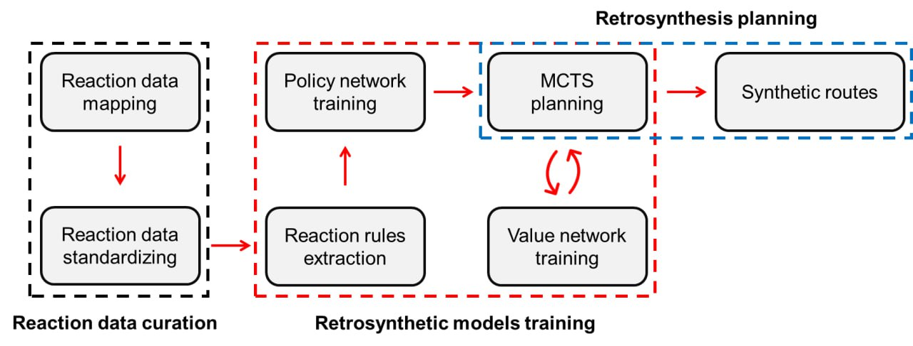

SynTool
========
SynTool (SYNthesis planning TOol) is a tool for computer-aided retrosynthesis planning.

Introduction
---------------------------
SynTool combines Monte-Carlo Tree Search (MCTS) with graph neural networks for the prediction of reaction
rules and synthesizability of intermediate products. SynTool can be directly used for retrosynthesis planning
with pre-trained policy/value neural networks (planning mode) or can be trained from scratch for the custom reaction data
using an automated end-to-end training pipeline (training mode).

SynTool pipeline
---------------------------
SynTool is a multilayered software for the computer-aided synthesis planning. It includes original modules for reaction data
curation, reaction rules extraction, and retrosynthesis planning with Monte-Carlo tree search (MCTS) algorithm coupled with
neural networks for node expansion and evaluation in MCTS. SynTool can be used for training retrosynthetic models from any
source of reaction data. Below, the main steps of this pipeline are listed.

**1. Reaction data mapping**
Reaction mapping is a necessary step in reaction data curation.
See the details in :ref:`reaction_mapping`.

**2. Reaction data standardization**
Reaction standardization is a necessary step in reaction data curation. It requires already mapped reactions.
See the details in :ref:`reaction_standardization`.

**3. Reaction data filtration**
Reaction data filtration ensures the validity of reaction rules extracted from the reactions.
See the details in :ref:`reaction_filtration`.

**4. Reaction rules extraction**
Reaction rules should be extracted from the high-quality reaction data prepared by the data curation steps listed above.
See the details in :ref:`reaction_rules_extraction`.

**5. Policy network training**
Policy network training is needed for the node expansion in the tree search algorithm.
See the details in :ref:`policy_network`.

**6. Value network training**
Value network training is needed for the node evaluation in the tree search algorithm.
See the details in :ref:`value_network`.

**7. Retrosynthesis planning**
After the preparation of the reaction rules and trained retrosynthetic model,
the retrosynthesis planning of target molecules can be performed.
See the details in :ref:`retrosynthesis_planning`.

.. toctree::
    :hidden:

    installation
    user_guide
    reaction_mapping
    reaction_standardization
    reaction_filtration
    reaction_rules_extraction
    policy_network
    value_network
    retrosynthesis_planning