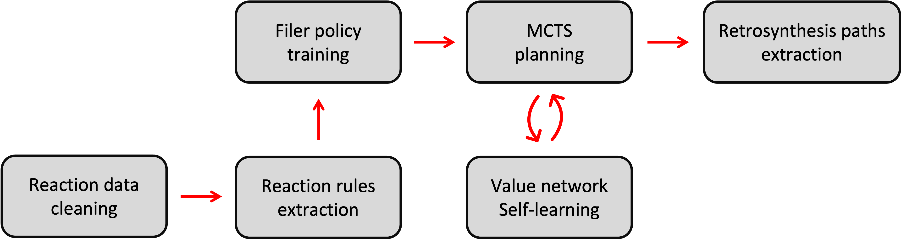

SynTool
========
SynTool (SYNthesis planning TOol) is a tool for chemical synthesis planning based on Monte-Carlo Tree Search (MCTS) with
various implementations of policy and value functions.

SynTool combines Monte-Carlo Tree Search (MCTS) with graph neural networks for the prediction of reaction
rules and synthesizability of intermediate products. Synto can be directly used for retrosynthesis planning
with pre-trained policy/value neural networks (planning mode) or can be fine-tuned to the custom data
using an automated end-to-end training pipeline (training mode).

.. toctree::
    :hidden:

    installation
    user_guide
    reaction_mapping
    reaction_standardization
    reaction_filtration
    reaction_rules_extraction
    policy_network
    value_network
    tree_search